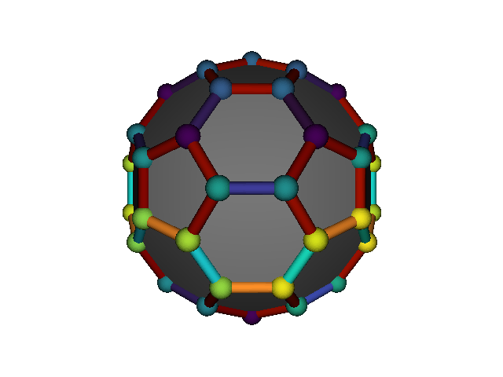

## QuViz
cpp visualization library for quantum physics based on libigl

## Getting Started

```bash
git clone git@github.com:cpp977/QuViz.git
mkdir build && cd build
cmake ../QuViz
```

## Dependencies

`QuViz`  depends on [libigl](https://github.com/libigl/libigl).
libigl should be downloaded in a parallel folder.
Other dependencies of `QuViz` are:
-[vivid](https://github.com/gurki/vivid) for color support.
-[hdf5](https://www.hdfgroup.org/solutions/hdf5/)

## Gallery

Example plot for te C60 molecule:

